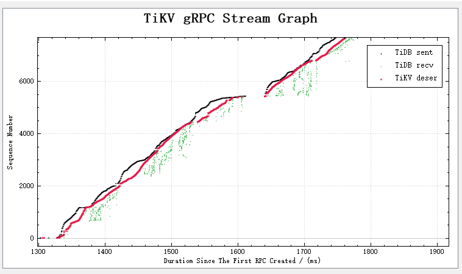
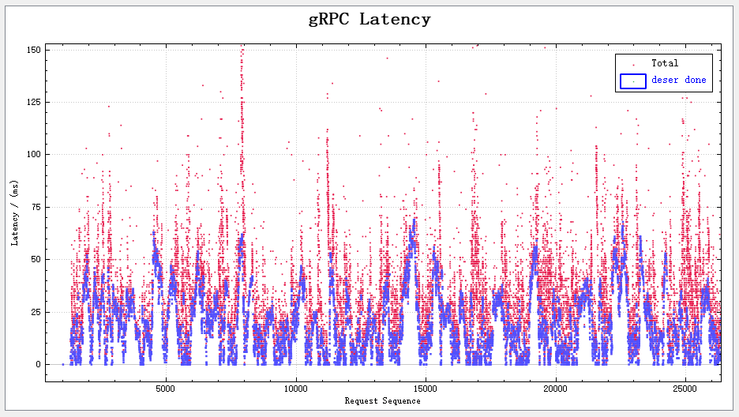
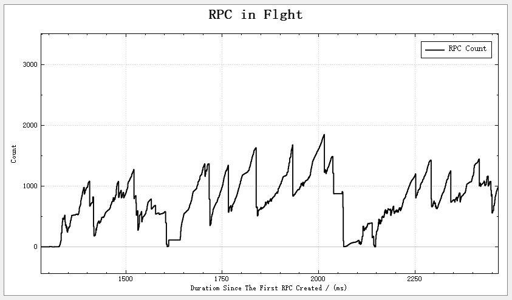

# 低开销TiDB与TiKV间的gRPC全链路延迟追踪

## 方案

分别在TiDB和TiKV的代码中加入测量点，每条测量记录包含`(RPC请求唯一编号， 位置， 时间戳)`，最后将所有记录收集、合并、分析。

#### 细节

- 在两端都使用大缓冲区存所有测量记录

    - 该方案仅为高精度测量测试用，缓冲区大小够用即可，测试时使用的数组是百万计，可以支持百万条RPC请求
    - 也可以借鉴循环缓冲来在特定情况下开启tracing记录，但暂时无此需求

- 测量记录均在进程停止时才将测量记录dump出来

    - 可以扩展一下暴露一个dump指令接口，比如htp请求或者signal
    - 对于我的目的，够用了

- 时间戳

    - 使用UnixNano
    - TiKV侧时间戳使用`SystemTime`拿到的时间，比使用`Duration`开销降低约`40%`
    - TiDB测时间错使用`Duration`比使用原始时间开销更低

- 唯一请求编号

    - TiDB和TiKV间默认建立4条TCP连接用于gRPC（当然这个连接数可调）
    - 每条连接，默认从0开始分配request_id
    - 多条连接导致仅从request_id上无法作出区分
    - 对这个的简单处理是对每条连接起始分配id在高位作区分，比如第一条连接序号从10000000000开始，第二条从20000000000开始，以此类推

- 网络

    - 所有服务跑在同一个机器上，走loopback，消除不必要的网络问题
    - Wireshark在刚刚发布的新版本中，对ProtoBuf支持相对完善了（从源码的作者邮箱看，是腾讯的工程师贡献的）
    - 字段提取暂时还只在GUI上有支持，tshark还不能用，倒是可以写lua自己decode，但还得花点时间
    - 暂时使用手工方式，在GUI上提取request_id和时间戳，导出为csv格式，再处理

- 单机环境

    - 如果是在不同机器上，分别从TiDB和TiKV获取时间，还要信源差异，单机可以规避这个问题
    - 可以用taskset为不同服务分配不同CPU核数，模拟一套cluster环境，在和真实核数机器的对比测试中，结果相当
    - 没有NVMe环境下，可以使用/dev/shm作为所有数据文件存储的地方，效果与NVMe相当
    - dm-delay可以用来模拟不同延迟级别的I/O设备

## 开销

- TiKV

    - sysbench oltp_update_index负载下，在2020.12.5日的对比测试中结果是启用了延迟追踪的TiKV开销占比`0.281%`(数据仅供参考，因为相同配置，每次跑也会有一定误差)
    - 记录存储优化
        - 之前uBench对比对测试了`std::mpsc`/`crossbeam`/`flume`，`flume`明显差于前两者，前两者相当，但明显差于vec.push方式
        - `#[inline]`耗时为不inline的`1/2`
        - SystemTime方式耗时大约占Duration方式的`60%`
    - vec push的百万级uBench结果是：`4ns/op`

- TiDB（待补充）

    - Golang中拿一个时间戳耗时在`50ns`左右
    - Zap日志方式不如我的方式开销低，无论如何它都会有字符串操作，开销高
    - ZeroLog开销也不低

## 展示

我一开始是把数据导入R里处理的，R自带的plot速度最快，但不能交互，没法选点查看属性，plotly可以交互，但生成速度比较慢。

图形选择上，还是散点图容易观察一些，我加入了alpha，不然多数区域和离群点的密度不好区分。但还不够满意，在发现Wireshark的TCP Stream Graph对百万级点阵处理如此流畅的情况下，我准备参考Wireshark方式做出更具有交互性的展示图。Wireshark使用的plot库是QCustomPlot, KUTrace用的是D3, 考虑到用JavaScript可能更方便，打算用D3设计渲染一下。

- Jager中展示opentracing的问题

  - 可以选择小范围的展示，trace展示结果多了的时候，很慢
  - 正因为大数据量情况下满，全局图景没法看到
  - 它的UI在大数据量下没法做对比，一屏只能看几条Trace

- D3不好用（2020.12.13更新）

  - 昨天12.12试了一下D3，可以调出来，但缩放重绘太卡，基本不能用，转而尝试QCustomPlot
  
- QCustomPlot很好用（2020.12.13更新）[Code][3]

  - QCustomPlot性能很好，加载全部`929348`条RPC完整记录耗时1559ms，不到4s时可以将所有图绘制完成，绘制完成后，缩放很方便，双轴、单轴缩放都可以，而且非常流畅，感受不到重绘延迟
  - 参考tcptrace graph，也绘制了一个图，横坐标为时间（毫秒精度），纵坐标为TiDB发出的RPC请求序号。同一个纵坐标对应3个点，3个点对应横坐标分别为我记录的`DB1`、`DE2`和`DB2`三个位置
  
    
    
  - 对上面的图衍生出另外两张图，一张是上面每个请求的几个时间点在横坐标的投影构成的单个请求各阶段延迟，这也是最初用R绘制出来的图
  
    
    
  - 另一张即为同一时间点在纵坐标方向上的投影，这个意义是`在途RPC个数`（RPC in Flight）
  
    
    
    - 解读：我期待这个图是开始阶段逐渐上升，中间保持平稳，最后逐渐降低至0的。然而实际情况是中间阶段波动巨大，在途RPC个数不断降至0,这个的意义是断流了。比如第1600ms后出现一次断流，可以与第一张图该位置交叉对照。在断流窗口内，没有新RPC请求发出，也没有新的RPC响应收到。

## 其他

- TracingSummit会议专注于Tracing技术

    - LTTng号称开销小于`1%`，crates.io上有封装，没有尝试
    - KUTrace，超低开销trace工具，在一组trace工具个[对比][1]中，它是最低的

        - 配置起来麻烦一点，需要打内核补丁，作者在文档中说可能要数个小时来打补丁
        - 作者的博士导师是Knuth
        - 很想试用
        - 2020.02的[slide][2] （Example 3 client-server database）
    
- rr

    - 帮助我理解TiKV的gRPC处理部分帮助巨大
    - rr可以做到事后调试、重复调试、倒序执行
    - 限制只能在单核运行，高负载不好还原真实场景
    - 要求Intel处理器，开启PMU，云服务器基本都把PMU关了。AMD的开始有一些支持，但看issue里还有问题

- Intel PT/RTIT

    - 翻张银奎老师的《软件调试（卷一） 硬件基础》看到的
    - RTIT - 实时指令追踪，2015年后的Intel CPU才有的一个部件，专门用于Tracing，声称开销低于`5%`
        - 我觉得这个可能最强，专利图显示是CPU内部有专门部件负责此事，按说这种方式应该是最低影响CPU指令执行部件的

- Frida（待补充）
- bpftrace（待补充）

[1]: https://tracingsummit.org/ts/2017/files/TS17-kutrace.pdf
[2]: http://web.stanford.edu/class/ee380/Abstracts/200205-slides.pdf
[3]: https://github.com/YKG/grpc-stream-graph
